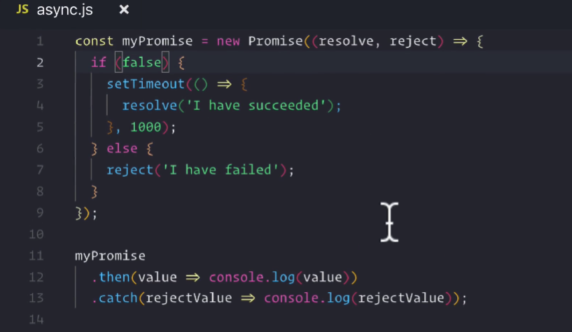
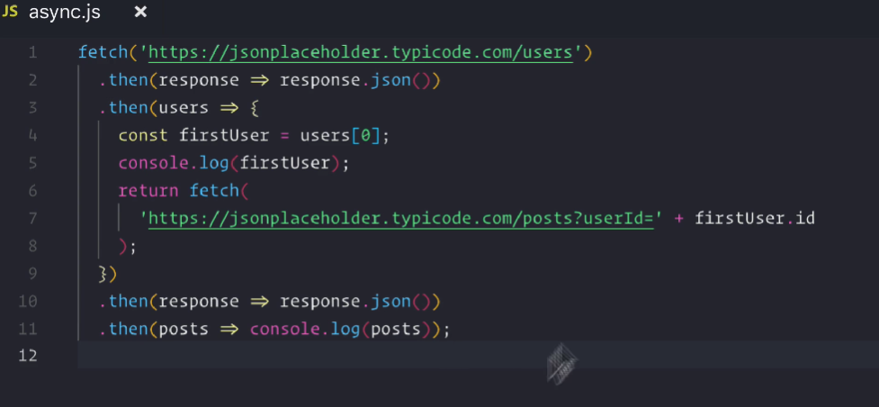
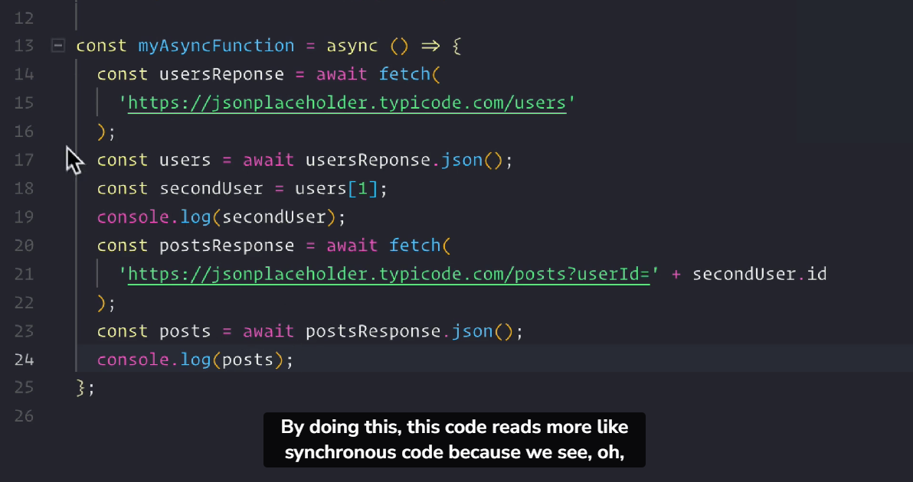
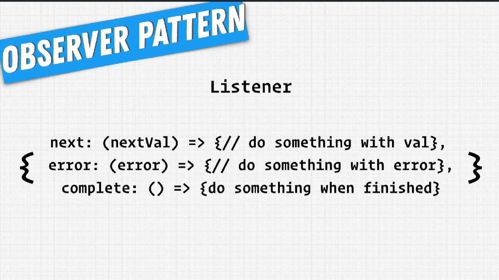
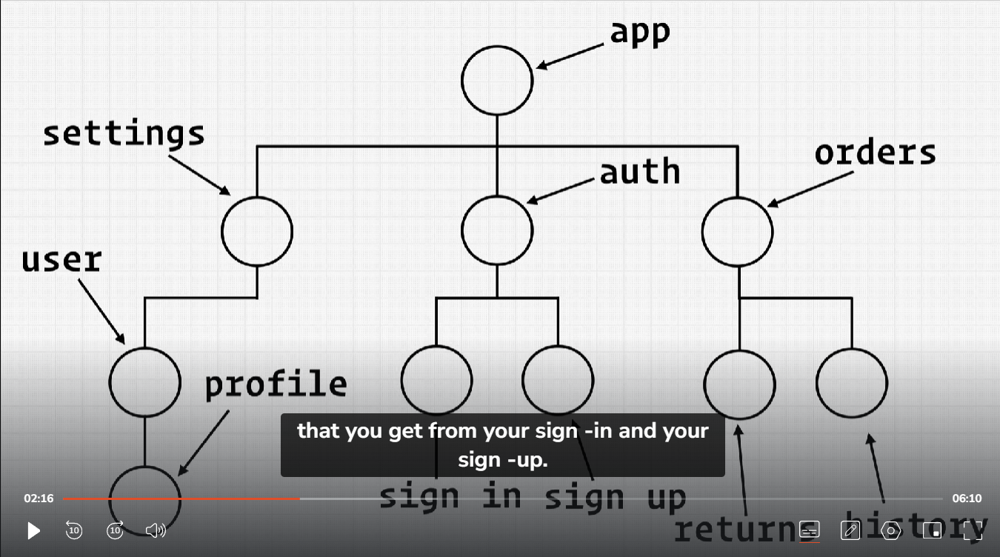
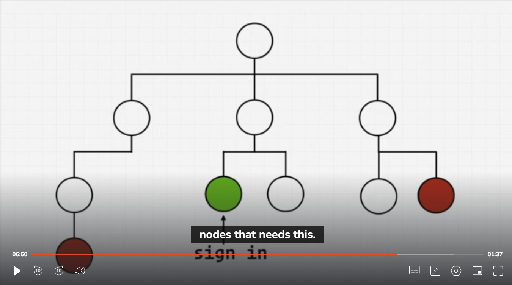
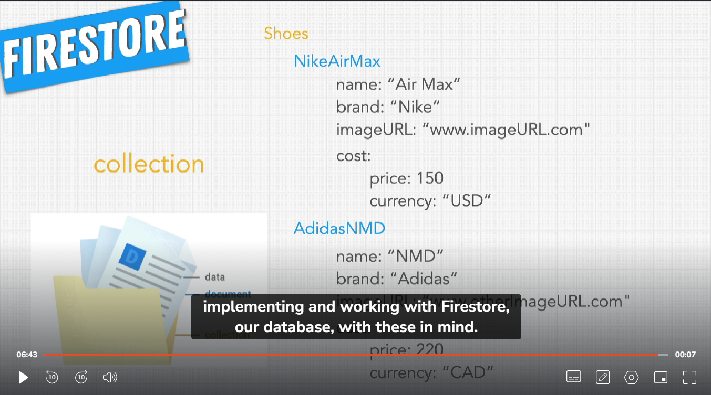

## apendix - key developer concepts:-

Understanding javascript asynchronous event handling:

- with ES6 there was promises that got introduced as a means of handling asynchronous events.
- asynchronous functions - we don't know when those would complete.
  
- so what we're getting with this promise is control over what we want to do with asynchronous events if they succed or fail.
- By having reject , we are able to control the seperation of successful API callback from an unsuccessful API callback & that's the main benefit of using promises.
- U can only call .then() on a resolved promise.
  

---

- with ES7 , a new function that was introduced called Async await that will allow us to better handle how we write our asynchronous code.
- It is a way to write functions that contain promise - oriented or asynchronous code that looks synchronous.
  const myAsyncFunction = async () => { // javascript knows we want to make an async function.
  // by using this async keyword within our async function , we're now allowed to use await keyword.
  // what await does is it pauses function execution until what is being awaited is completed & comes back with value
  const value=await fetch(someValue) // now what happens is until i get back something from fetch func the below lines of code will wait until fetch comes back with a value
  }
  
  Add a try catch block to handle the error

Array Methods - map() , filter() , reduce() , find() , includes()

- map() method ->
  - const myArray=[1,2,3,4]
  - myArray.map(element => element+1) gives [2, 3, 4, 5]
  - myArray.map(()=>"b") gives ['b', 'b', 'b', 'b']

### React context continued.

https://css-tricks.com/snippets/css/complete-guide-grid/

### Observer Pattern.

React Context:

- `Implicit Subscription:` Components using the useContext hook implicitly subscribe to changes in the context value.
- `Context Provider as Subject:` The Context Provider acts somewhat like the "subject" in the Observer pattern. It holds the shared state and triggers re-renders in subscribing components whenever the context value changes.
- `Consumers as Observers:` Components using useContext are akin to "observers." They are notified (via re-renders) when the context value they're interested in changes.

* We can observer that we're spreading out all of the code w.r.t useContext in multiple places.So what we want to do is we want to be able to now move this code into one centralized place.And luckily for us `FIrebase` actually gives us a way to do that.
* we can start using what's known as `observable listener`. An observable llistener is a way for us to hook into some kind of stream of events.we import onAuthStateChange from firebase/auth.
  

### React context for state Management

From the above picture we can see that from auth either through sign-in or sign-up component we get the `user` object which is needed by other siblings of auth - settings & orders components as well , so since the `app` is the corresponding highlevelCOmponent which can only be able to pass the `user` object to settings & orders compponent from `auth` component.`sign-in` can't pass it directly to them.As seen with components we can pass props doen into children.so how do we make this work?how do we get the `user`data from `sign-in` node to other `red-nodes`?

- This is where react context comes into picture , it allows us to store our data somewhere so that anyone needs it can access from it.This is context.

* If you have multiple components that all listening to a context , even though they don't use the actual values , will cause react to re-run your function but not re-render anything to the DOM.

### Authentication + Firebase

We're going to build our sign in page using authentication so that we can store the users & refer to those users whenever anyone wants to access our application.

- Firebase is a google platform that allows you to spin up a database.It helps us leverage some kind of database.
- We will be leveraging Authentication & FireStore Database [MyFirebaseAccount](https://console.firebase.google.com/project/crwn-clothing-e2e-db/overview)
- Now we need to allow our application to leverage Authentication and Firestore db from Firebase.To do that we need to install firebase library. `yarn add firebase`.
- Understanding the flow of how firebase works with users and their gmail signIn.
  - Lets say as a `User` i use google-signIn to SignIn into our Website.
  - User Makes a request to google server saying i want to sign-in for this crw@gmail.com.
  - The google verifies the credentials & generates an `auth-token`.A unique hashed string.& sends that back to our website.
  - Then our webssite sends that `auth-token` to `firebase`.
  - Then Firebase asks google to verify this `auth-token`. if it's valid , google sends back a `verification-token`.
  - Then Firebase creates a `access-token`.This `access-token` is going to define what the user should be able to access.Inside of DB.\* It sends back to the website.
  - Then User with this `access-token` can make CRUD Requests.Then FIrebase is going to determine by verifying the access_token to what different things token has access to.

* when it comes to interfacing with some kind of backend API's that might have particular nuances to it inside of it's own folder.So in case of firebase , Inside `src` folder , i will have `utils` folder , this is going to contain utility files.We make `firebase` folder and create `firebase.utils.jsx file`

* Next we have to make sure whenever a user Authenticates , we also create a record of them inside FireSTore DB.

  - About FIrebase Data Model: It comprises of three things: There is the `collection > document > data`. `>` means let's say `inside of it.`

  * We have collection of users , we will have a separate collection for users - we will know users inside of our db.
  * Each document represents individual piece of data , so an independent user.
  * Now the actual information related to that user is going to be data.
    

* Now go to console > create database > set location to closest to you > Go to Rules ( define who is allowed to modify what documents) . switch allow read , write from false to true as we're only developing it. Then hit publish.
* now go to firebase.utils.js

#### Purpose of the Three Dots (...)

The three dots (...) in setFormFields({ ...formFields, [name]: value }); represent the spread syntax in JavaScript.

In this context, its purpose is to:

Copy: It creates a shallow copy of the formFields object. This is important because in React, you should avoid directly mutating state objects. Instead, you should create new state objects to trigger re-renders.

Merge: It allows you to easily merge the copied properties from the existing formFields with the new property ([name]: value) representing the changed input field. This creates a new object with all the updated form field values.

### Take notes from signUpFOrm Part2

### Routing + react-router

[reactRouter](https://reactrouter.com/en/main) - Overview : React Router enables "client side routing".Client side routing allows your app to update the URL from a link click without making another request for another document from the server.Instead, your app can immediately render some new UI and make data requests with fetch to update the page with new information.In traditional websites, the browser requests a document from a web server, downloads and evaluates CSS and JavaScript assets, and renders the HTML sent from the server. When the user clicks a link, it starts the process all over again for a new page
Install the dependencies - `yarn add react-router-dom@6`

The Home Page should be the component that renders when your URL is the baseURL.The Navigation Bar should persist always no matter what different page we navigate to.

- In order for us to confirm and tell our application that we want to use react router DOm , what we need to do is wrap the entire application in a router component that react-router-dom gives us.We will do it in index.js , it's where we render our `APP` as it's entirety.

* create `routes` folder , that will hold all of our route top level components.
* `import Routes & Route components`.With these two components we can actually assemble the routing at our application level.`Wrap the Home component with Routes component.`
* what essentially `Routes` does is it allows this application to `register these route level component`s that in turn will render a specific component when it matches the specific route that we're looking for. So how do we know what route we're trying to match. we do it by giving it a specific `path` variable. `<Route path='/'>` this relative path matches to the baseURL.The moment this matches i want you to render HOME component by giving it in the element. `<Route path='/' element={<HOME/>}>`.
* An <Outlet> should be used in parent route elements to render their child route elements. This allows nested UI to show up when child routes are rendered. If the parent route matched exactly, it will render a child index route or nothing if there is no index route.
* To render Home component with Navigation component sitting at top level all the time , we use index in the nested route of home component , it tells react that what u need to render as well when there's / alone in the Navigation component ROute iunside of Outlet component.
* In React, a `Fragment` is a special component that allows you to group multiple elements without adding an extra node to the DOM. It's essentially an "invisible" container.

  - When to use Fragments
  - When you need to return multiple elements from a component
  - When you want to avoid adding unnecessary DOM nodes
  - When you want to improve the readability of your JSX

* styling : create assets folder to add logo images..etc

### yarn add sass

Sass is a powerful CSS preprocessor that adds features like variables, nesting, mixins, and more, making your CSS more maintainable and organized. Dart Sass is the primary and recommended implementation. yarn add sass will install Dart Sass by default.In this project we have `categories.styles.scss`.Sass files (usually with the .scss extension) need to be compiled into CSS files before browsers can understand them.

# Getting Started with Create React App

This project was bootstrapped with [Create React App](https://github.com/facebook/create-react-app).

## Available Scripts

In the project directory, you can run:

### `npm start`

Runs the app in the development mode.\
Open [http://localhost:3000](http://localhost:3000) to view it in your browser.

The page will reload when you make changes.\
You may also see any lint errors in the console.

### `npm test`

Launches the test runner in the interactive watch mode.\
See the section about [running tests](https://facebook.github.io/create-react-app/docs/running-tests) for more information.

### `npm run build`

Builds the app for production to the `build` folder.\
It correctly bundles React in production mode and optimizes the build for the best performance.

The build is minified and the filenames include the hashes.\
Your app is ready to be deployed!

See the section about [deployment](https://facebook.github.io/create-react-app/docs/deployment) for more information.

### `npm run eject`

**Note: this is a one-way operation. Once you `eject`, you can't go back!**

If you aren't satisfied with the build tool and configuration choices, you can `eject` at any time. This command will remove the single build dependency from your project.

Instead, it will copy all the configuration files and the transitive dependencies (webpack, Babel, ESLint, etc) right into your project so you have full control over them. All of the commands except `eject` will still work, but they will point to the copied scripts so you can tweak them. At this point you're on your own.

You don't have to ever use `eject`. The curated feature set is suitable for small and middle deployments, and you shouldn't feel obligated to use this feature. However we understand that this tool wouldn't be useful if you couldn't customize it when you are ready for it.

## Learn More

You can learn more in the [Create React App documentation](https://facebook.github.io/create-react-app/docs/getting-started).

To learn React, check out the [React documentation](https://reactjs.org/).

### Code Splitting

This section has moved here: [https://facebook.github.io/create-react-app/docs/code-splitting](https://facebook.github.io/create-react-app/docs/code-splitting)

### Analyzing the Bundle Size

This section has moved here: [https://facebook.github.io/create-react-app/docs/analyzing-the-bundle-size](https://facebook.github.io/create-react-app/docs/analyzing-the-bundle-size)

### Making a Progressive Web App

This section has moved here: [https://facebook.github.io/create-react-app/docs/making-a-progressive-web-app](https://facebook.github.io/create-react-app/docs/making-a-progressive-web-app)

### Advanced Configuration

This section has moved here: [https://facebook.github.io/create-react-app/docs/advanced-configuration](https://facebook.github.io/create-react-app/docs/advanced-configuration)

### Deployment

This section has moved here: [https://facebook.github.io/create-react-app/docs/deployment](https://facebook.github.io/create-react-app/docs/deployment)

### `npm run build` fails to minify

This section has moved here: [https://facebook.github.io/create-react-app/docs/troubleshooting#npm-run-build-fails-to-minify](https://facebook.github.io/create-react-app/docs/troubleshooting#npm-run-build-fails-to-minify)
